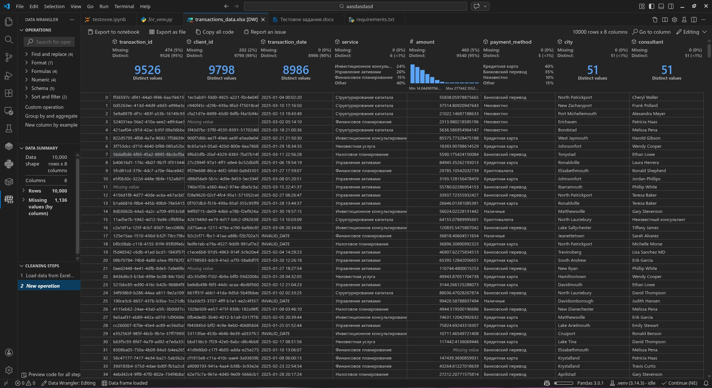
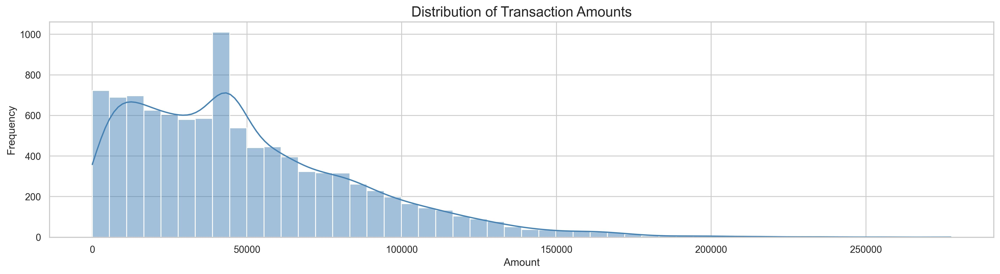
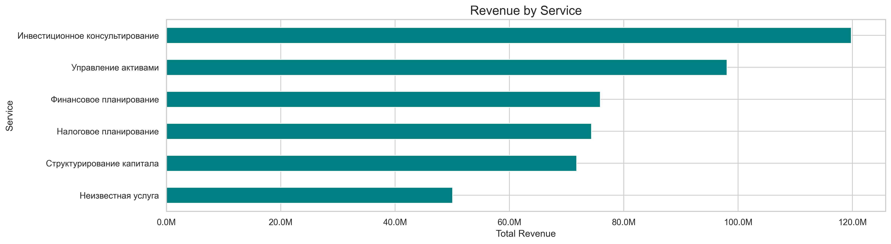
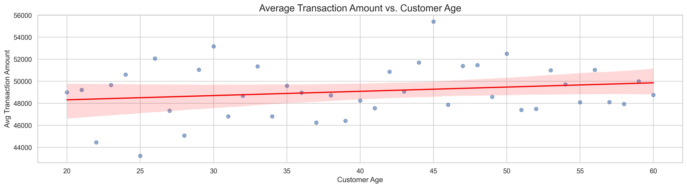
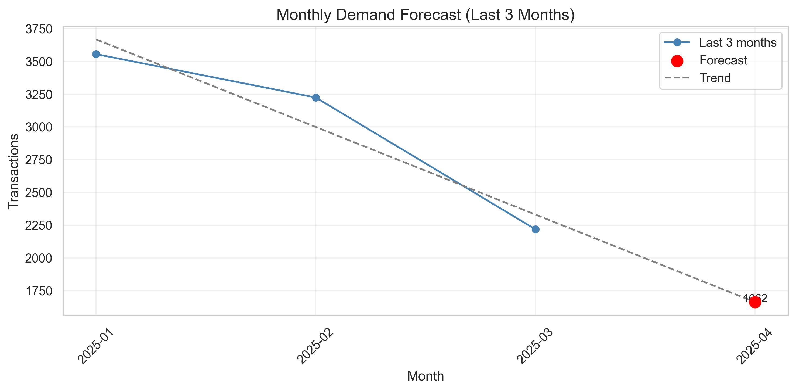

# Transaction Analysis Project

This project analyzes transaction data to uncover patterns, trends, and insights about customer behavior and business performance.

## Project Overview

This analysis explores transactional data to understand key business metrics and identify opportunities for improvement. The project includes data cleaning, exploratory data analysis, visualization, and statistical modeling to extract meaningful insights.

## Key Metrics

* Revenue trends over time
* Customer purchase patterns
* Product category performance
* Seasonal variations in transactions
* Customer segmentation analysis

## Technologies Used

* **Python** - Programming language
* **pandas** - Data manipulation and analysis
* **numpy** - Numerical computing
* **matplotlib** - Data visualization
* **seaborn** - Statistical data visualization
* **scikit-learn** - Machine learning algorithms

## Installation

To run this project, you'll need to install the required dependencies:

```bash
pip install -r requirements.txt
```

## How to Run

1. Clone this repository
2. Install the required dependencies
3. Go to testovoe.ipynb

## Visualizations

Key charts and graphs generated during analysis include:

1. Overall picture of data before any manipulations:



2. Distribution of transactions:



3. Revenue by service:



4. Average Transaction Amount by Age:



5. Monthly Demand Forecast:



## License

MIT License - see LICENSE file for details.
